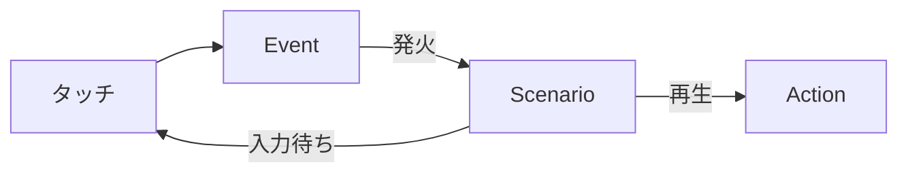

# Action / Event / Scenario 設計概要

従来の Event / Reaction を **Action / Event / Scenario** の3概念に再整理する。

## 3つの概念

```
Action   … 「何を見せるか」  セリフ・アニメ・表情・ボイスの最小単位
Event    … 「いつ起きるか」  条件を満たしたら Scenario を起動するトリガー
Scenario … 「どう進むか」   Action列 + 入力待ち の一連の流れ（台本）
```

## 関係



- **Event** が発火すると **Scenario** が始まる。常に1対1。
- **Scenario** は **Action** の列で構成される。途中でプレイヤーの入力を待つこともある。
- **Action** は表現の最小単位。Scenario の中でも、通常タッチの反応でも使われる。

## 基本フロー

```
1. ユーザーがタッチする
2. パラメータが更新される + 操作履歴が記録される
3. 全 Event に「発火するか？」を聞く
   ├─ どれも発火しない → 通常の Action を返して終了
   └─ 発火した → そのEventが指す Scenario を起動
4. Scenario が進行する（Action表示 → 入力待ち → Action表示 → ...）
5. Scenario 終了 → 通常モードに復帰
```

## Main / Sub シナリオ

|      | Main                       | Sub         |
| ---- | -------------------------- | ----------- |
| 再生回数 | 1回きり                       | 何度でも        |
| 例    | 初キス、処女喪失                   | 頭撫でおねだり     |
| 制御方法 | Event の発火条件に「未完了であること」を含める | 条件を満たせば毎回発火 |

詳細は [[Action-Event-Scenario詳細設計]] を参照。
