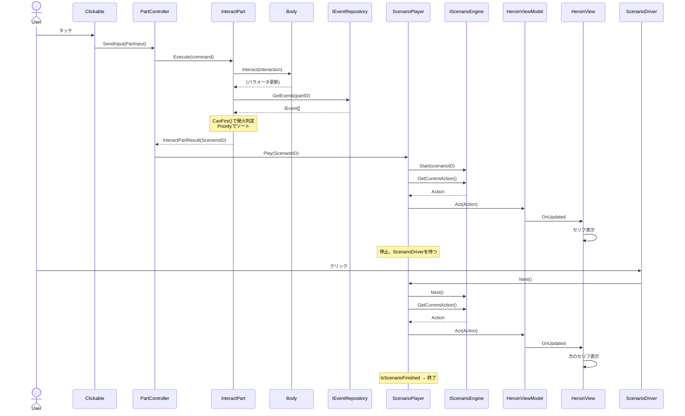

# Action / Event / Scenario 詳細設計

[[Action-Event-Scenario概要]] の各部の詳細。

---

## Action

セリフ・アニメ・表情・ボイスをまとめた Value Object。副作用なし。

```csharp
public class Action
{
    public string Dialogue { get; }
    public string AnimationName { get; }
    public string ExpressionName { get; }
    public string VoiceClipName { get; }
}
```

Scenario の中でも通常タッチ反応でも、ヒロインが何かを「見せる・言う」ときは常にこの型を使う。

---

## Event

`IEvent` インターフェースとして定義。各実装が自分の発火条件を自己判定する。

```csharp
public interface IEvent
{
    ScenarioID ScenarioToStart { get; }
    EventPriority Priority { get; }     // Main > Sub
    bool CanFire();
}
```

### 自己完結の原則

各 Event 実装は、発火判定に必要なデータソースを **コンストラクタで受け取る**。呼び出し側は `CanFire()` を呼ぶだけで、何が必要かを知らない。

```csharp
// 例: 累計タッチ0回で発火する初回系イベント
public class FirstTouchEvent : IEvent
{
    private readonly IInteractionHistory history;
    private readonly IScenarioProgress progress;
    private readonly PartID targetPart;

    public bool CanFire()
    {
        return history.GetTouchCount(targetPart) == 0
            && !progress.IsCompleted(ScenarioToStart);
    }
}
```

### Event が参照するインターフェース

| インターフェース       | 提供する情報                                                |
| ---------------------- | ----------------------------------------------------------- |
| `IInteractionHistory`  | 累計タッチ回数、直前タッチ部位などの操作履歴                |
| `IPartParameterReader` | 各部位の Pleasure / Development / Affection（読み取り専用） |
| `IScenarioProgress`    | シナリオの完了状態（Main の1回きり制御に使う）              |

Event は `Body` や `Part` に直接依存しない。必要な情報ごとに狭いインターフェースを参照する。

### EventFactory

Event インスタンスの組み立てはファクトリ（Infrastructure層）が行う。マスターデータから Event 群を生成し、各実装に必要な依存を注入する。

### 発火優先度

複数 Event が同時に発火した場合、`Priority` で解決する。Main が Sub より優先。

---

## Scenario

Action列 + 入力待ちで構成される台本。Yarn Spinner で外部定義する。

### IScenarioEngine

Domain 層が知るのはこのインターフェースだけ。Yarn Spinner の語彙は一切含まない。

```csharp
public interface IScenarioEngine
{
    bool IsScenarioFinished { get; }
    Action GetCurrentAction();
    void Next();
    void Start(ScenarioID scenarioID);
}
```

ScenarioPlayer が Start → GetCurrentAction で最初の Action を取得し、以降は Next → GetCurrentAction で進行する。IsScenarioFinished が true になったらシナリオ終了。

### 実行の流れ



### Infrastructure での実装

現在は `ListScenarioEngine` がハードコードされた Action 列を返す簡易実装。将来的に Yarn Spinner ベースの実装に差し替え可能。

```csharp
// 現在の実装: 固定データ
public class ListScenarioEngine : IScenarioEngine
{
    // ScenarioID に対応する Action 列をハードコードで返す
    // Start() でインデックスリセット、Next() でインデックス進行
}

// 将来の実装: Yarn Spinner をラップ
public class YarnSpinnerScenarioEngine : IScenarioEngine
{
    // Yarn の Line → Action に変換
}
```

---

## レイヤー配置

```
Domain層
├── Entity:       Body, Part, Action, Interaction
├── ValueObject:  PartID, ScenarioID, Pleasure, Development, Affection
├── Interface:    IEvent, IScenarioEngine
├── Repository:   IEventRepository, IReactionRepository
└── (将来)       IInteractionHistory, IPartParameterReader, IScenarioProgress

Application層
├── UseCase:      InteractPart
└── DTO:          InteractPartCommand, InteractPartResult

Infrastructure層
├── Engine:       ListScenarioEngine (→ 将来 YarnSpinnerScenarioEngine)
├── Repository:   EventRepository (DefaultEvent内包), ReactionRepository
└── (将来)       EventFactory

Presentation層 (C# DLL)
├── Controller:   PartController
├── ViewModel:    HeroinViewModel
├── Player:       ScenarioPlayer
└── Input:        PartInput

Presentation層 (Unity MonoBehaviour)
├── Clickable:    部位クリック検知
├── HeroinView:   ViewModel購読 → Debug.Log表示
└── ScenarioDriver: クリックで ScenarioPlayer.Next()

DI層 (Unity)
└── ZrushyInstaller: Zenjectバインド設定
```

## 設計判断メモ

- **Event 実装は Domain 層**: 発火条件はドメインロジック。依存先は Domain 内インターフェースのみ。
- **EventFactory は Infrastructure 層**: DI 組み立て + マスターデータ読み込みのため。
- **IPartParameterReader を分離**: Event が Body の Interact() 等にアクセスするのを型で防ぐ。
- **全演出を Scenario 化**: Event → Scenario のパイプラインを統一。1行セリフの Scenario は複数 Event で再利用される。
- **1回きり制御は Event 側**: Event の発火条件に `IScenarioProgress.IsCompleted` を含めて実現。
