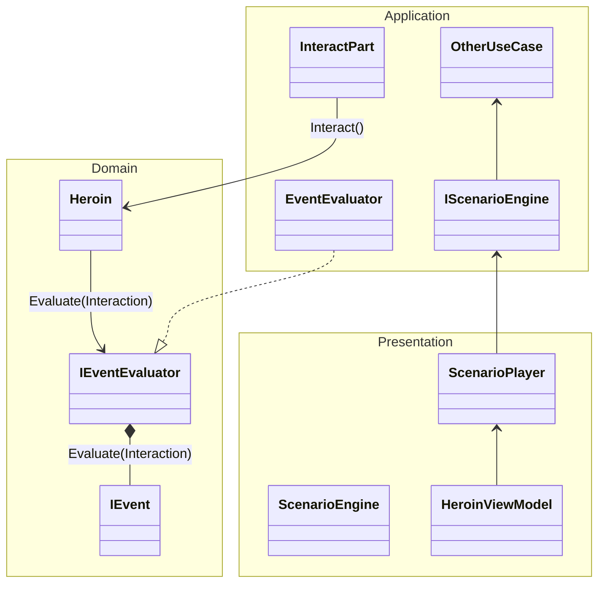

```mermaid
classDiagram

namespace Application{
	class InteractPart
	class OtherUseCase
	class IScenarioEngine
	class EventEvaluator
}
namespace Domain{
	class Heroin
	class IEventEvaluator
	class IEvent
}
namespace Presentation{
	class ScenarioEngine
	class ScenarioPlayer
	class ScenarioEngine
	class HeroinViewModel
}

InteractPart --> Heroin : Interact()
Heroin --> IEventEvaluator : Evaluate(Interaction)
IEventEvaluator *-- IEvent : Evaluate(Interaction)
OtherUseCase <-- IScenarioEngine
IScenarioEngine <-- ScenarioPlayer
ScenarioPlayer <-- HeroinViewModel
EventEvaluator ..|> IEventEvaluator
```
