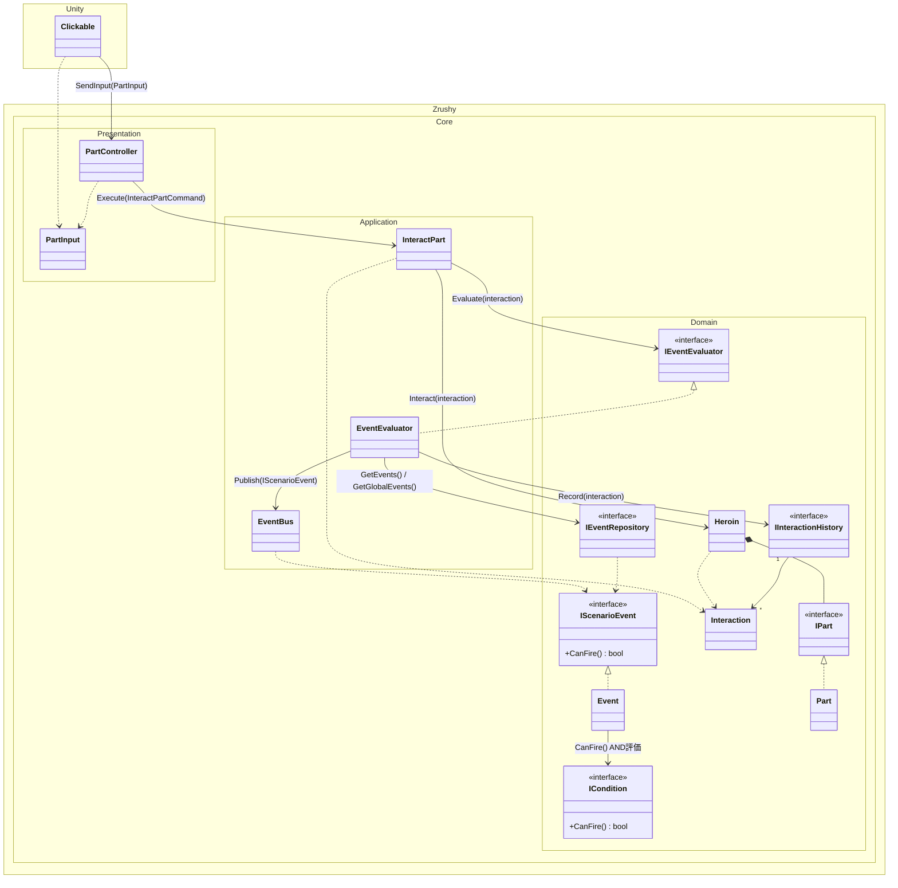

```mermaid
classDiagram
namespace Unity {
    class Clickable
}

namespace Zrushy.Core.Presentation {
    class PartController
    class PartInput
}

namespace Zrushy.Core.Application {
    class InteractPart
    class EventEvaluator
    class EventBus
}

namespace Zrushy.Core.Domain {
    class Heroin
    class IEventEvaluator {
        <<interface>>
    }
    class IEventRepository {
        <<interface>>
    }
    class IInteractionHistory {
        <<interface>>
    }
    class IScenarioEvent {
        <<interface>>
        +CanFire() bool
    }
    class ICondition {
        <<interface>>
        +CanFire() bool
    }
    class Event
    class Interaction
    class IPart{
        <<interface>>
    }
    class Part
}

Clickable --> PartController : SendInput(PartInput)
Clickable ..> PartInput
PartController ..> PartInput
PartController --> InteractPart : Execute(InteractPartCommand)
InteractPart --> Heroin : Interact(interaction)
InteractPart --> IEventEvaluator : Evaluate(interaction)
InteractPart ..> Interaction
IEventEvaluator <|.. EventEvaluator
EventEvaluator --> IInteractionHistory : Record(interaction)
EventEvaluator --> IEventRepository : GetEvents() / GetGlobalEvents()
EventEvaluator --> EventBus : Publish(IScenarioEvent)
EventBus ..> IScenarioEvent
IScenarioEvent <|.. Event
Heroin ..> Interaction
Event --> ICondition : CanFire() AND評価
IEventRepository ..> IScenarioEvent
IInteractionHistory "1" --> "*" Interaction
Heroin *-- IPart
IPart <|.. Part
```
