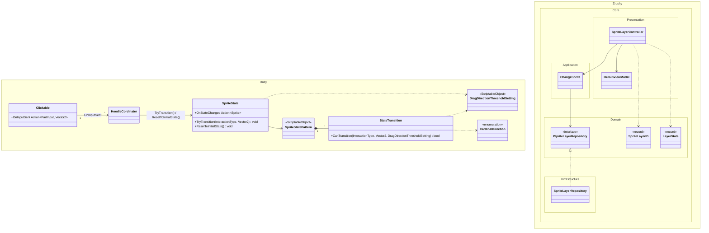

```mermaid
classDiagram
namespace Unity {
    class Clickable {
        +OnInputSent Action~PartInput, Vector2~
    }
    class HoodieCordinater
    class SpriteState {
        +OnStateChanged Action~Sprite~
        +TryTransition(InteractionType, Vector2) void
        +ResetToInitialState() void
    }
    class SpriteStatePattern {
        <<ScriptableObject>>
    }
    class StateTransition {
        +CanTransition(InteractionType, Vector2, DragDirectionThresholdSetting) bool
    }
    class DragDirectionThresholdSetting {
        <<ScriptableObject>>
    }
    class CardinalDirection {
        <<enumeration>>
    }
}

namespace Zrushy.Core.Presentation {
    class SpriteLayerController
    class HeroinViewModel
}

namespace Zrushy.Core.Application {
    class ChangeSprite
}

namespace Zrushy.Core.Domain {
    class ISpriteLayerRepository {
        <<interface>>
    }
    class SpriteLayerID {
        <<record>>
    }
    class LayerState {
        <<record>>
    }
}

namespace Zrushy.Core.Infrastructure {
    class SpriteLayerRepository
}

Clickable "1" --> "*" HoodieCordinater : OnInputSent
HoodieCordinater --> SpriteState : TryTransition() / ResetToInitialState()
SpriteState --> SpriteStatePattern
SpriteStatePattern "1" *-- "*" StateTransition
StateTransition ..> DragDirectionThresholdSetting
StateTransition ..> CardinalDirection
SpriteState ..> DragDirectionThresholdSetting

SpriteLayerController --> ChangeSprite
SpriteLayerController --> HeroinViewModel
ChangeSprite --> ISpriteLayerRepository
ISpriteLayerRepository <|.. SpriteLayerRepository
SpriteLayerController ..> SpriteLayerID
SpriteLayerController ..> LayerState
```
