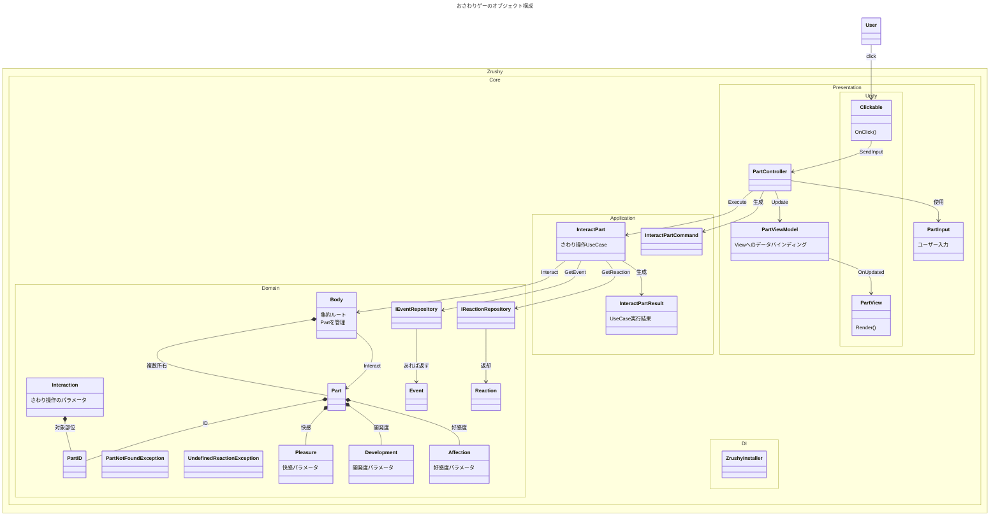

おさわりゲーのオブジェクト構成

```mermaid
---
title: おさわりゲーのオブジェクト構成
---
classDiagram
	namespace Zrushy.Core.Domain {
		class Body {
			集約ルート
			Partを管理
		}
		class Part
		class Interaction {
			さわり操作のパラメータ
		}
		class Event
		class Reaction
		class IEventRepository
		class IReactionRepository
		class PartID
		class PartNotFoundException
		class UndefinedReactionException
		class Pleasure {
			快感パラメータ
		}
		class Development {
			開発度パラメータ
		}
		class Affection {
			好感度パラメータ
		}
	}
	namespace Zrushy.Core.Application {
		class InteractPart {
			さわり操作UseCase
		}
		class InteractPartCommand
		class InteractPartResult {
			UseCase実行結果
		}
	}
	namespace Zrushy.Core.Presentation {
		class PartController
		class PartViewModel {
			Viewへのデータバインディング
		}
		class PartInput {
			ユーザー入力
		}
	}
	namespace Zrushy.Core.Presentation.Unity {
		class Clickable {
			OnClick()
		}
		class PartView{
			Render()
		}
	}
	namespace Zrushy.Core.DI {
		class ZrushyInstaller
	}

	%% ユーザー操作フロー
	User --> Clickable : click
	Clickable --> PartController : SendInput
	PartController --> PartViewModel : Update
	PartViewModel --> PartView : OnUpdated
	
	%% コマンド実行フロー
	PartController --> PartInput : 使用
	PartController --> InteractPartCommand : 生成
	PartController --> InteractPart : Execute
	InteractPart --> Body : Interact
	Body --> Part : Interact
	
	%% データ取得フロー
	InteractPart --> IReactionRepository : GetReaction
	IReactionRepository --> Reaction : 返却
	InteractPart --> IEventRepository : GetEvent
	IEventRepository --> Event : あれば返す
	InteractPart --> InteractPartResult : 生成
	
	%% 集約・所有関係
	Body *-- Part : 複数所有
	Part *-- PartID : ID
	Part *-- Pleasure : 快感
	Part *-- Development : 開発度
	Part *-- Affection : 好感度
	Interaction *-- PartID : 対象部位
```
