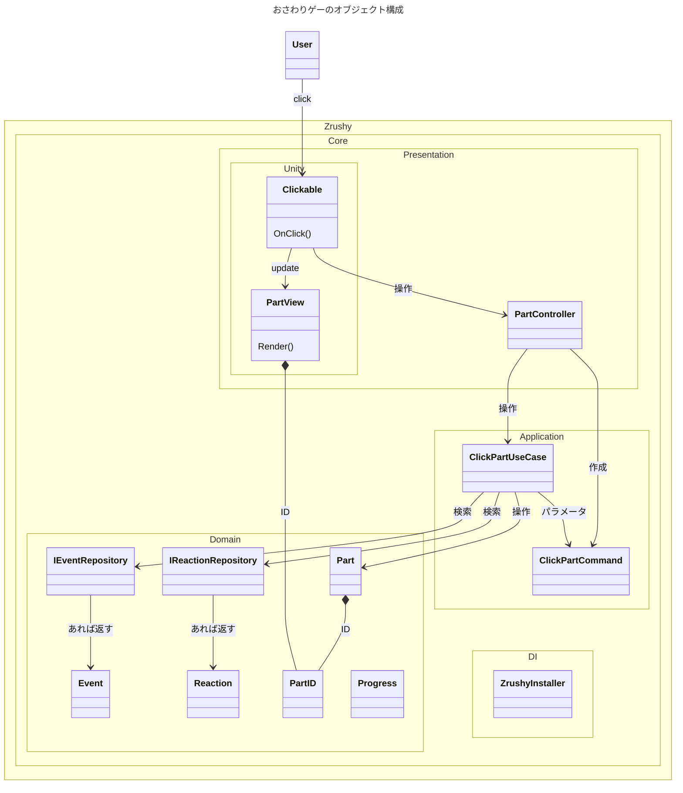

おさわりゲーのオブジェクト構成

```mermaid
---
title: おさわりゲーのオブジェクト構成
---
classDiagram
	namespace Zrushy.Core.Domain {
		class Part
		class Event
		class Reaction
		class IEventRepository
		class IReactionRepository
		class PartID
		class Progress
	}
	namespace Zrushy.Core.Application {
		class ClickPartUseCase
		class ClickPartCommand
	}
	namespace Zrushy.Core.Presentation {
		class PartController
	}
	namespace Zrushy.Core.Presentation.Unity {
		class Clickable {
			OnClick()
		}
		class PartView{
			Render()
		}
	}
	namespace Zrushy.Core.DI {
		class ZrushyInstaller
	}

	User --> Clickable : click
	Clickable --> PartController : 操作
	Clickable --> PartView : update
	PartController --> ClickPartCommand : 作成
	PartController --> ClickPartUseCase : 操作
	ClickPartUseCase --> Part : 操作
	ClickPartUseCase --> ClickPartCommand : パラメータ
	ClickPartUseCase --> IEventRepository : 検索
	IEventRepository --> Event : あれば返す
	ClickPartUseCase --> IReactionRepository : 検索
	IReactionRepository --> Reaction : あれば返す
	Part *-- PartID : ID
	PartView *-- PartID : ID
```
