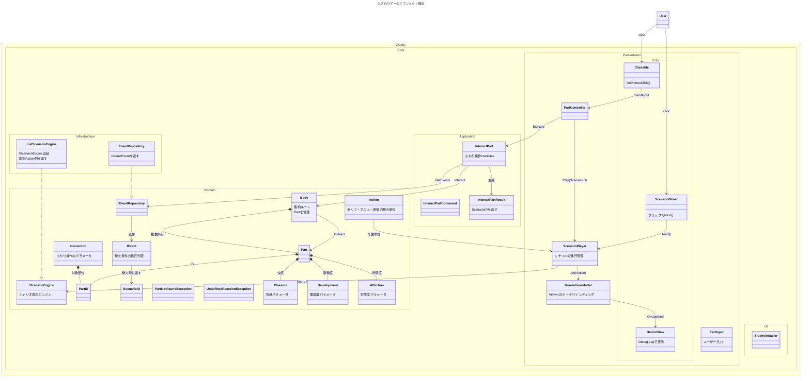

おさわりゲーのオブジェクト構成

```mermaid
---
title: おさわりゲーのオブジェクト構成
---
classDiagram
	namespace Zrushy.Core.Domain {
		class Body {
			集約ルート
			Partを管理
		}
		class Part
		class Interaction {
			さわり操作のパラメータ
		}
		class Action {
			セリフ・アニメ・表情の最小単位
		}
		class IEvent {
			発火条件の自己判定
		}
		class IScenarioEngine {
			シナリオ再生エンジン
		}
		class IEventRepository
		class PartID
		class ScenarioID
		class PartNotFoundException
		class UndefinedReactionException
		class Pleasure {
			快感パラメータ
		}
		class Development {
			開発度パラメータ
		}
		class Affection {
			好感度パラメータ
		}
	}
	namespace Zrushy.Core.Application {
		class InteractPart {
			さわり操作UseCase
		}
		class InteractPartCommand
		class InteractPartResult {
			ScenarioIDを返す
		}
	}
	namespace Zrushy.Core.Infrastructure {
		class ListScenarioEngine {
			IScenarioEngine実装
			固定Action列を返す
		}
		class EventRepository {
			DefaultEventを返す
		}
	}
	namespace Zrushy.Core.Presentation {
		class PartController
		class ScenarioPlayer {
			シナリオの進行管理
		}
		class HeroinViewModel {
			Viewへのデータバインディング
		}
		class PartInput {
			ユーザー入力
		}
	}
	namespace Zrushy.Core.Presentation.Unity {
		class Clickable {
			OnPointerClick()
		}
		class HeroinView {
			Debug.Logで表示
		}
		class ScenarioDriver {
			クリックでNext()
		}
	}
	namespace Zrushy.Core.DI {
		class ZrushyInstaller
	}

	%% ユーザー操作フロー（タッチ → シナリオ開始）
	User --> Clickable : click
	Clickable --> PartController : SendInput
	PartController --> InteractPart : Execute
	InteractPart --> Body : Interact
	Body --> Part : Interact
	InteractPart --> IEventRepository : GetEvents
	IEventRepository --> IEvent : 返却
	InteractPart --> InteractPartResult : 生成

	%% シナリオ再生フロー
	PartController --> ScenarioPlayer : Play(ScenarioID)
	ScenarioPlayer --> IScenarioEngine : Start / GetCurrentAction
	ScenarioPlayer --> HeroinViewModel : Act(Action)
	HeroinViewModel --> HeroinView : OnUpdated

	%% シナリオ送りフロー
	User --> ScenarioDriver : click
	ScenarioDriver --> ScenarioPlayer : Next()

	%% Infrastructure実装
	ListScenarioEngine ..|> IScenarioEngine
	EventRepository ..|> IEventRepository

	%% 集約・所有関係
	Body *-- Part : 複数所有
	Part *-- PartID : ID
	Part *-- Pleasure : 快感
	Part *-- Development : 開発度
	Part *-- Affection : 好感度
	Interaction *-- PartID : 対象部位
	IEvent --> ScenarioID : 発火時に返す
	Action --> ScenarioPlayer : 再生単位
```
