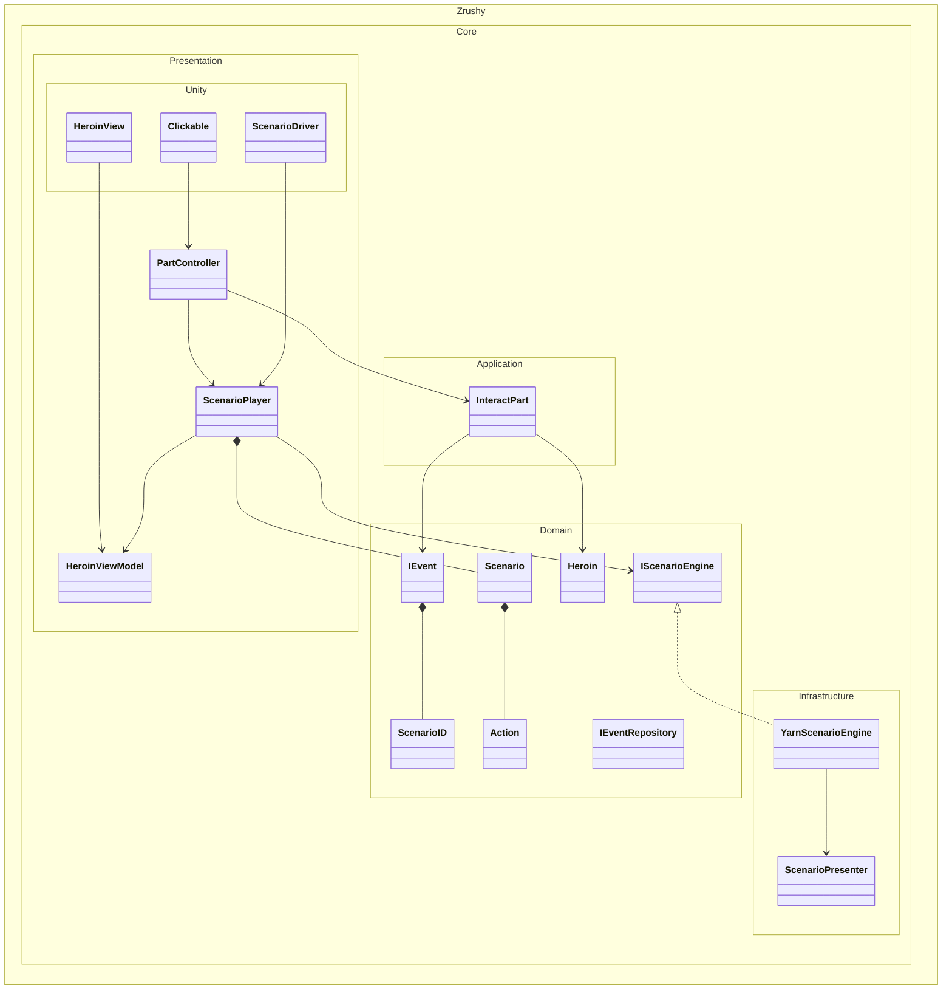

```mermaid
classDiagram

namespace Zrushy.Core.Presentation.Unity {
	class Clickable
	class HeroinView
	class ScenarioDriver
}

namespace Zrushy.Core.Presentation {
	class PartController
	class HeroinViewModel
	class ScenarioPlayer
}

namespace Zrushy.Core.Application {
	class InteractPart
}

namespace Zrushy.Core.Infrastructure {
	class YarnScenarioEngine
	class ScenarioPresenter
}

namespace Zrushy.Core.Domain {
	class Heroin
	class IEvent
	class IEventRepository
	class IScenarioEngine
	class Scenario
	class Action
	class ScenarioID
}

%% unity
HeroinView --> HeroinViewModel
Clickable --> PartController

%% presentation
PartController --> ScenarioPlayer
ScenarioDriver --> ScenarioPlayer
ScenarioPlayer --> HeroinViewModel
ScenarioPlayer --> IScenarioEngine
PartController --> InteractPart
ScenarioPlayer *-- Scenario

%% application
InteractPart --> Heroin
InteractPart --> IEvent

%% infrastructure
IScenarioEngine <|.. YarnScenarioEngine
YarnScenarioEngine --> ScenarioPresenter

%% domain
IEvent *-- ScenarioID
Scenario*-- Action
```
