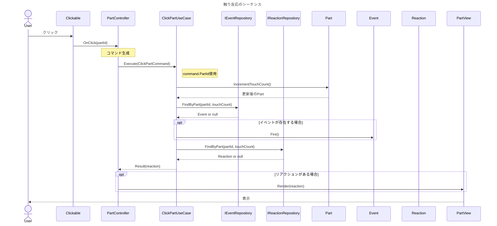

# 触り反応シーケンス図

```mermaid
---
title: 触り反応のシーケンス
---
sequenceDiagram
	actor User
	participant Clickable
	participant PartController
	participant ClickPartUseCase
	participant IEventRepository
	participant IReactionRepository
	participant Part
	participant Event
	participant Reaction
	participant PartView

	User ->> Clickable : クリック
	Clickable ->> PartController : OnClick(partId)

	Note over PartController: コマンド生成
	PartController ->> ClickPartUseCase : Execute(ClickPartCommand)
	Note right of ClickPartUseCase: command.PartId使用

	ClickPartUseCase ->> Part : IncrementTouchCount()
	Part -->> ClickPartUseCase : 更新後のPart

	ClickPartUseCase ->> IEventRepository : FindByPart(partId, touchCount)
	IEventRepository -->> ClickPartUseCase : Event or null

	opt イベントが存在する場合
		ClickPartUseCase ->> Event : Fire()
	end

	ClickPartUseCase ->> IReactionRepository : FindByPart(partId, touchCount)
	IReactionRepository -->> ClickPartUseCase : Reaction or null

	ClickPartUseCase -->> PartController : Result(reaction)

	opt リアクションがある場合
		PartController ->> PartView : Render(reaction)
	end

	PartView -->> User : 表示
```
