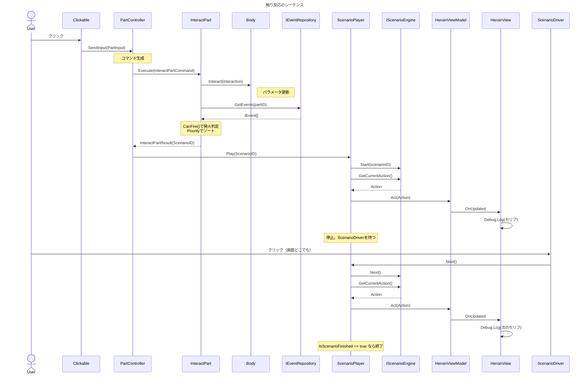

# 触り反応シーケンス図

```mermaid
---
title: 触り反応のシーケンス
---
sequenceDiagram
	actor User
	participant Clickable
	participant PC as PartController
	participant IP as InteractPart
	participant Body
	participant ER as IEventRepository
	participant SP as ScenarioPlayer
	participant SE as IScenarioEngine
	participant HVM as HeroinViewModel
	participant HV as HeroinView
	participant SD as ScenarioDriver

	User ->> Clickable : クリック
	Clickable ->> PC : SendInput(PartInput)

	Note over PC: コマンド生成
	PC ->> IP : Execute(InteractPartCommand)

	IP ->> Body : Interact(interaction)
	Note right of Body: パラメータ更新

	IP ->> ER : GetEvents(partID)
	ER -->> IP : IEvent[]
	Note over IP: CanFire()で発火判定<br/>Priorityでソート
	IP -->> PC : InteractPartResult(ScenarioID)

	PC ->> SP : Play(ScenarioID)
	SP ->> SE : Start(scenarioID)
	SP ->> SE : GetCurrentAction()
	SE -->> SP : Action
	SP ->> HVM : Act(Action)
	HVM ->> HV : OnUpdated
	HV ->> HV : Debug.Log(セリフ)

	Note over SP: 停止。ScenarioDriverを待つ

	User ->> SD : クリック（画面どこでも）
	SD ->> SP : Next()
	SP ->> SE : Next()
	SP ->> SE : GetCurrentAction()
	SE -->> SP : Action
	SP ->> HVM : Act(Action)
	HVM ->> HV : OnUpdated
	HV ->> HV : Debug.Log(次のセリフ)

	Note over SP: IsScenarioFinished == true なら終了
```

