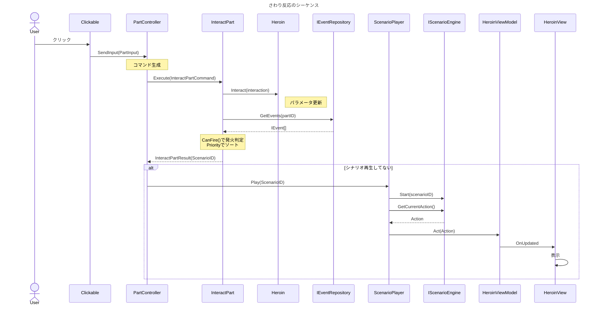
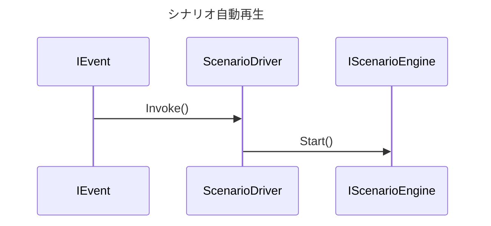

# 触り反応シーケンス図

```mermaid
---
title: さわり反応のシーケンス
---
sequenceDiagram
	actor User
	participant Clickable
	participant PC as PartController
	participant IP as InteractPart
	participant Heroin
	participant ER as IEventRepository
	participant SP as ScenarioPlayer
	participant SE as IScenarioEngine
	participant HVM as HeroinViewModel
	participant HV as HeroinView

	User ->> Clickable : クリック
	Clickable ->> PC : SendInput(PartInput)

	Note over PC: コマンド生成
	PC ->> IP : Execute(InteractPartCommand)

	IP ->> Heroin : Interact(interaction)
	Note right of Heroin: パラメータ更新

	IP ->> ER : GetEvents(partID)
	ER -->> IP : IEvent[]
	Note over IP: CanFire()で発火判定<br/>Priorityでソート
	IP -->> PC : InteractPartResult(ScenarioID)

alt シナリオ再生してない
	PC ->> SP : Play(ScenarioID)
	SP ->> SE : Start(scenarioID)
	SP ->> SE : GetCurrentAction()
	SE -->> SP : Action
	SP ->> HVM : Act(Action)
	HVM ->> HV : OnUpdated
	HV ->> HV : 表示
end
```

## シナリオループ

```mermaid
---
title: シナリオ自動再生
---
sequenceDiagram
	participant IEvent
	participant ScenarioDriver
	participant IScenarioEngine

	IEvent ->> ScenarioDriver : Invoke()
	ScenarioDriver ->> IScenarioEngine : Start()
```
