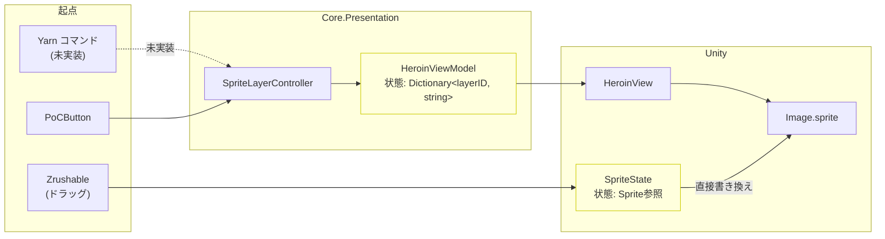

## やること

1. SpriteLayerRepository.cs — パス修正

- \_resourceRootPath を "Heroin" → "Heroin/Sprites" に変更

2. SpriteState.cs — VM 通知に切り替え

- \_image: Image フィールドを削除
- ISpriteLayerRepository を注入
- HeroinViewModel を注入
- SetState の \_image.sprite = newState を削除
- SetState の OnStateChanged 発火後に \_heroinViewModel.UpdateSprite(layerID, path) を追加
- Start/Awake の初期スプライト設定も VM 経由に変更

3. Unity Inspector 作業

- 各 SpriteState の Image 参照を外す
- HeroinView の SpriteLayerBindings[] に服ずらし各レイヤーのエントリを追加

4. Zenject Installer — 注入設定追加

- SpriteState への ISpriteLayerRepository / HeroinViewModel 注入を追加
