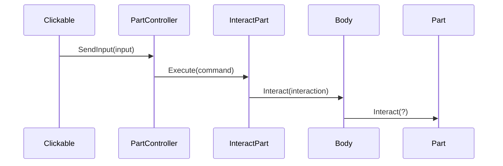
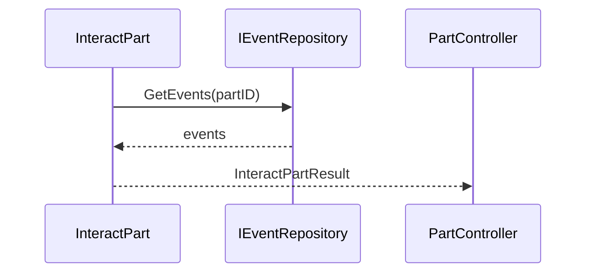
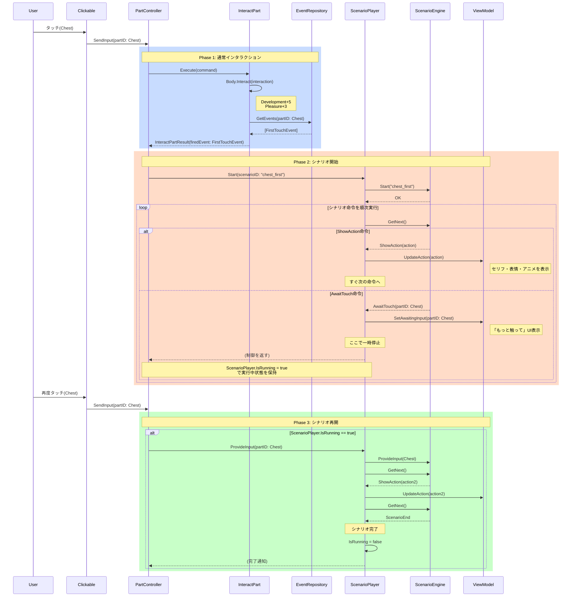
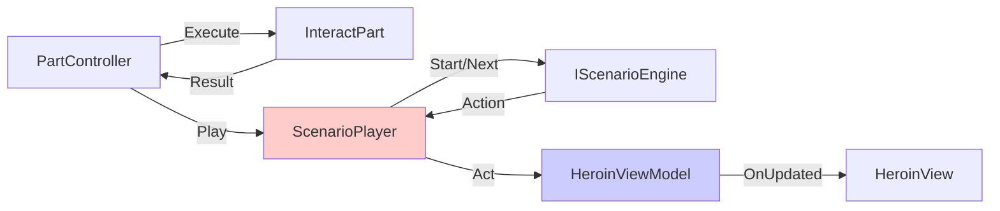
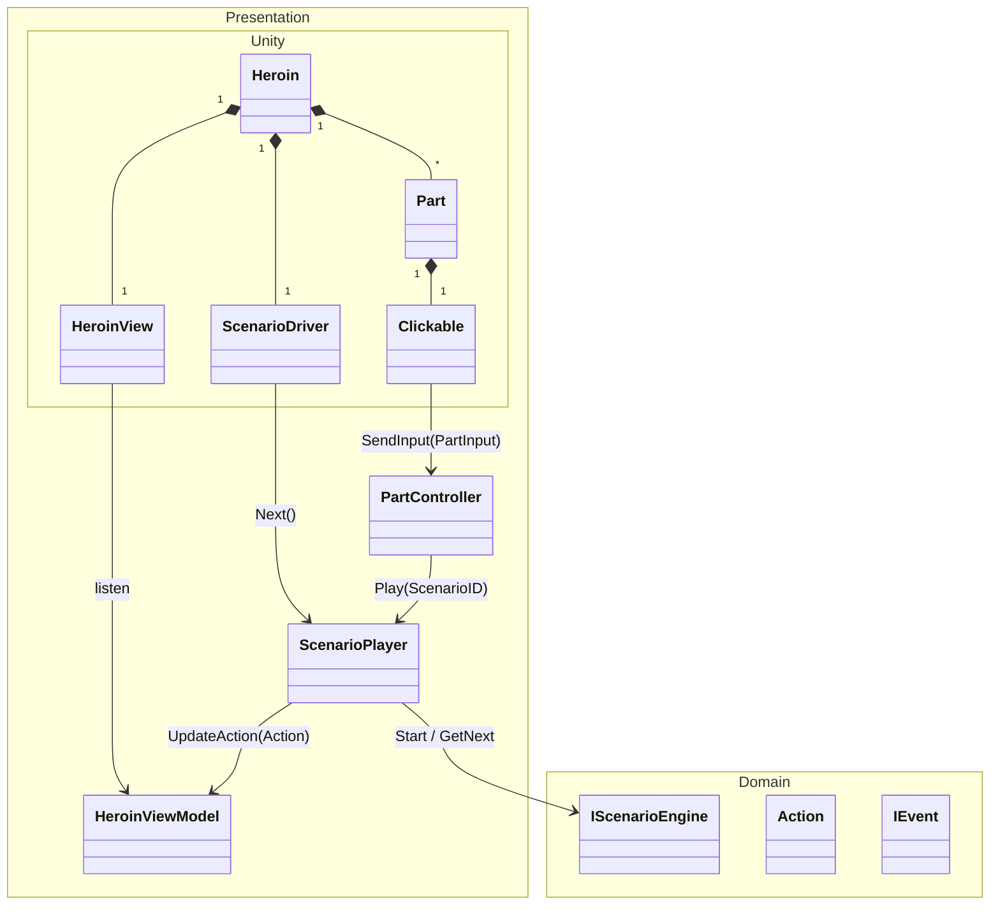
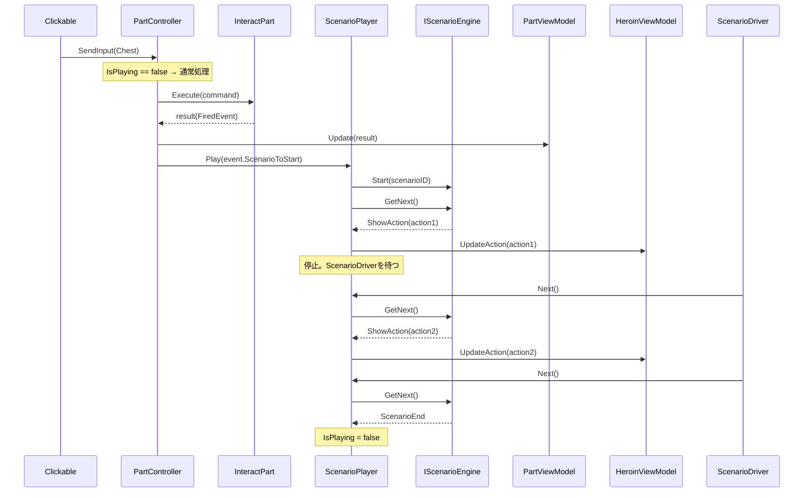

## Action-Event-Scenario 実装

オブジェクトの役割感がまったく湧いてないので、UseCase から組んでく

## 2026.01.31(Sat)

シナリオ送りの設計が全然うまいことわかねー

- さわり

- イベント取得

## 2026.02.01(Sun)

`ScenarioPlayer.Play(Scenario)`を internal にすれば、Unity から触られることはない
`ScenarioDriver`の名前は後で決めるとして、こいつが常に Update して`ScenarioPlayer.Next()`を叩くことで、ViewModel を更新する
`ViewModel --> View`のデータ送信は従来の`OnUpdated`イベント起動でいける

### claude からの質問

1. ScenarioDriver: 条件を満たさないときは早期 return
2. ScenarioPlayer: Next()で Scenario の次の Action をもらってくる
3. シナリオ的に分岐はある

### claude

1. シナリオの話の進行部分に yarn spinner を使おうと思ってるんですが、3 の解決に役立つことはありますか？
2. Unity 側のオブジェクト配置で忘れていましたが、`Heroin *-- Part` である必要がありました。Action によるアセット操作の範囲は、パーツ単位ではなくキャラクターまるまる 1 人分で考えています。もっといい変更の範囲があれば提案してください
    1. となると ScenarioPlayer の操作単位を ViewModel にするのは不適切かもしれません。でも Heroin 全体を操作できるオブジェクトは現状ないんですよね。Domain 側に Body はあるんですが

### シーン起動修正の実装

クリック → シナリオ再生の一連のフローが動く状態にするための実装を行った。

**問題点:**

- `IScenarioEngine`, `HeroinViewModel` の Zenject バインドがなく ScenarioPlayer 生成失敗
- `IScenarioEngine` の実装クラスが存在しない
- `EventRepository` が空リストを返し `UndefinedReactionException` 発生
- `HeroinView`, `ScenarioDriver` の MonoBehaviour が未作成

**実装内容:**

| ファイル                                       | 操作 | 内容                                                                          |
| ---------------------------------------------- | ---- | ----------------------------------------------------------------------------- |
| `Infrastructure/Engine/ListScenarioEngine.cs`  | 新規 | IScenarioEngine 実装。ScenarioID に対応する固定 Action 列を返す               |
| `Infrastructure/Repository/EventRepository.cs` | 変更 | DefaultEvent（CanFire 常に true）を返すように変更                             |
| `DI/ZrushyInstaller.cs`                        | 変更 | IScenarioEngine→ListScenarioEngine, HeroinViewModel バインド追加              |
| `Presentation/HeroinView.cs`                   | 新規 | HeroinViewModel 購読、Debug.Log でセリフ出力                                  |
| `Presentation/ScenarioDriver.cs`               | 新規 | InputSystem の Mouse.current.leftButton.wasPressedThisFrame で Next()呼び出し |

**結果:**

- dotnet test 11/11 パス
- Unity シーン起動 → パーツクリック → Debug.Log にセリフ表示 → クリックで Next → 次のセリフ表示 まで動作確認済み

### 残タスク

- シナリオの分岐機能の実装
- シナリオ、イベントのマスタ化
    - もっと整備しやすく、設定しやすくしたい
    - yarn spinner 使えばどっちもなんとかなるらしい。実際に触るときに確認しよう
- イベントの実装
- アクション(見た目変化)の実装
    - 見た目変化するってことは Clickable の位置とか調整できないとだめじゃね
