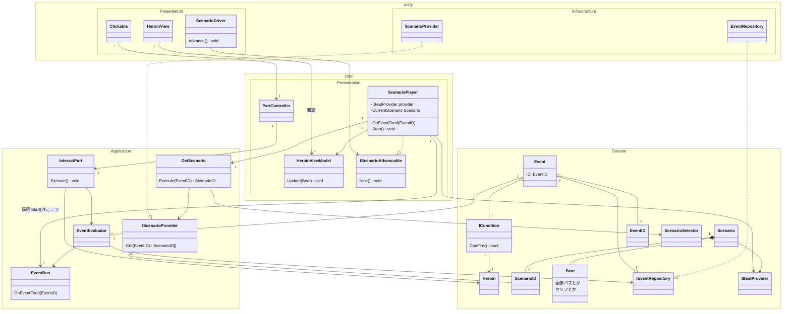

## リファクタリング TODO

### 新規作成

- [x] `IScenarioProvider` (Application層) — `Get(EventID) Scenario[]` ✅ 2026-03-20
- [x] `GetScenario` UseCase (Application層) ✅ 2026-03-20
- [x] `IScenarioAdvancable` (core.Presentation) — `Next() void` ✅ 2026-03-20
- [ ] `ScenarioProvider` (unity.Infrastructure) — `IScenarioProvider` の実装
  - 既存 `YarnEventRepository` との棲み分けを決める

### 変更

- [x] **EventBus**: publish 内容を `IScenarioEvent` → `EventID` に変更 ✅ 2026-03-20
- [x] **ScenarioPlayer**: EventBus 購読を追加（購読内で `Start()` 呼び出し）、`GetScenario` 経由でシナリオ取得、`Play(ScenarioID)` → `Start()` にリネーム、`IScenarioAdvancable` を実装 ✅ 2026-03-20
- [ ] **ScenarioDriver**: EventBus 購読ロジックを削除、`IScenarioAdvancable` だけ参照するように変更

---

