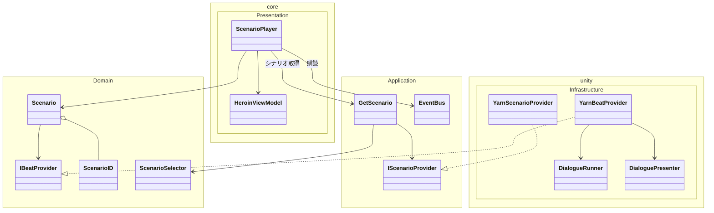

```mermaid
classDiagram

namespace Domain{
class Scenario
class IBeatProvider
class ScenarioID
class ScenarioSelector
}
Scenario --> IBeatProvider
Scenario o-- ScenarioID

namespace Application{
class GetScenario
class IScenarioProvider
class EventBus
}

namespace core.Presentation{
class ScenarioPlayer
class HeroinViewModel
}
ScenarioPlayer --> Scenario
ScenarioPlayer --> EventBus : 購読
ScenarioPlayer --> GetScenario : シナリオ取得
GetScenario --> ScenarioSelector
GetScenario --> IScenarioProvider
ScenarioPlayer --> HeroinViewModel

namespace unity.Infrastructure{
class YarnBeatProvider
class DialogueRunner
class DialoguePresenter
class YarnScenarioProvider
}
YarnBeatProvider ..|> IBeatProvider
YarnBeatProvider --> DialogueRunner
YarnBeatProvider --> DialoguePresenter
YarnScenarioProvider ..|> IScenarioProvider
```
