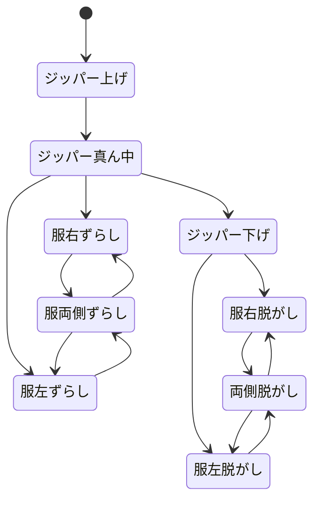

やること

- [x] LinePresenter でセリフ表示
- [x] さわり反応が再生できることを確認
- [ ] 確認できて yarn でいいじゃんってなったら、旧 Scenario 実装を破棄する
- [ ] シナリオ表示の仕様をざっくり決めて、それを満たすような設定にする
- [ ] 割り込み禁止！
- [ ] イラスト差し替えコマンド
- [ ] デバッグしたい
- [ ] アセット描け

## 消すやつ

core 層

- ScenarioPlayer.cs
- IScenarioAdvancable.cs
- HeroinViewModel.cs
- IBeatProvider.cs
- Beat.cs

Unity 層

- YarnBeatProvider.cs
- ZrushyDialoguePresenter.cs

ZrushyInstaller の binding 削除

- 上記クラスに対応する Bind の記述

## イラスト差し替え

フーーど
ジッパー、服右、服左でずらすのがよさそう

