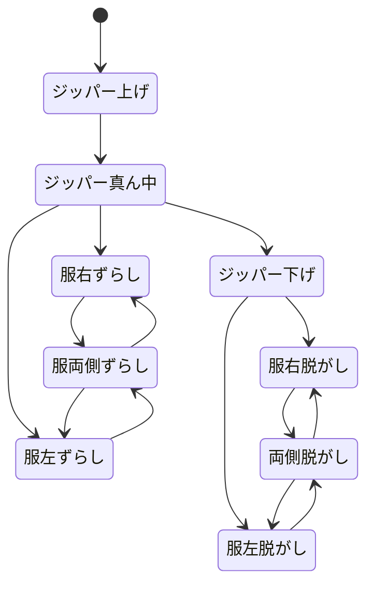

- hoodie の差し替え差分を用意した
    ステートが

こんな感じ
レイヤーを

- ジッパー
- 服右
- 服左

の 3 グループ 3 状態で分けていたが、アセットとして出力するのは上の各ステートの状態で表示する 9 枚の画像にした。

## SpriteStatePattern が画像そのまま持てるなら core の ChangeSprite 系いらないかも

旧導線

1. PartController
2. ChangeSprite
3. SpriteLayerRepository
    1. ここで `Heroin/(partID)/(state)`の文字列を返す
4. HeroinViewModel に登録
5. HeroinViewModel「更新したよ！」
6. HeroinView「確認します」
7. 更新

新導線

1. Clickable（旧 PartController）
2. SpriteState.TryTransition(type, direction)
3. StateTransition.CanTransition でマッチ判定
4. image.sprite = matched.toState
