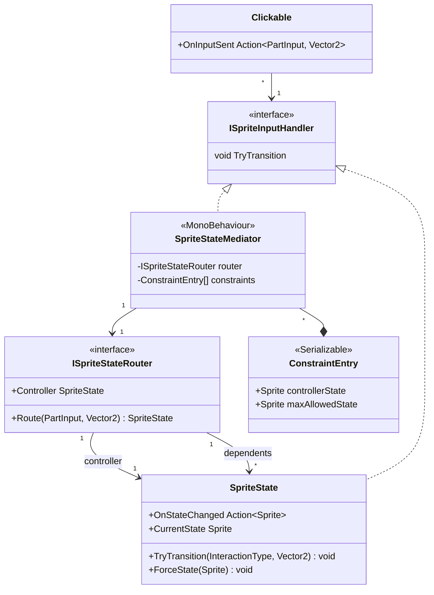

`HoodieCordinator` から名前変更。服だけじゃなくてズボンとかでも制約をかけそうなので、抽象化する

---

Hoodie だけでなく、pants & under bottom(ショーツ？)でも同様に mediator が必要になりそうなので、ここは抽象化して使いまわしたい。

下側の制約
「パンツ」=下着、「ズボン」=下着の上に履くやつ

- パンツはズボンが「ある程度」脱がされていないと、脱がせない(=遷移できない。または当たり判定を発生させない？)
    - 「ある程度」: 段階による……4 段階？
    - 上/股間スレスレ/ふともも/脱げ
    - 「ふともも」まで脱がせていたら、パンツも脱がせられる
- パンツはズボンの脱げ状態より先の脱げ状態に、ズボンより先に遷移することはできない
    - ズボン: ふともも => パンツ: ふともも まで
- パンツの状態遷移は 上/股間スレスレ/ふともも/膝/脱げ
- 制約は下表の感じで
- 制約: パンツの状態 <= ズボンの状態

| ズボン   | パンツ   |
| -------- | -------- |
| 上       | 上       |
| 股間     | 股間     |
| ふともも | ふともも |
| -        | 膝       |
| 脱げ     | 脱げ     |

- 前提
    状態は隣り合った状態へしか遷移しない

「コントローラー」: 状態遷移の制約元となる SpriteState
「依存側」: 状態遷移を制約される SpriteState

各状態を線形に持ったデータ構造: 不要
隣り合った状態にしか遷移しないなら、コントローラの各状態で取りうる依存側の Sprite を定義すればいい

## 設計

パンツ・ズボンでも同じ構造が使えるよう、データドリブンな MonoBehaviour として設計する。
`HoodieCordinator` はこのクラスをフード用に設定したもの（クラスは共通）。

`SpriteState.ForceState()` は新規追加が必要（`ResetToInitialState()` の汎用版）。

## 実装

作る処理は以下の 3 つ

1. Clickable.OnInputSent → mediator 受信
2. mediator → 対象 SpriteState を特定
   依存側なら CanTransition で事前チェック → OK なら TryTransition
   コントローラーなら TryTransition 直接
3. コントローラーの OnStateChanged → mediator 受信
   各依存側の CurrentState が制約違反なら ForceState
