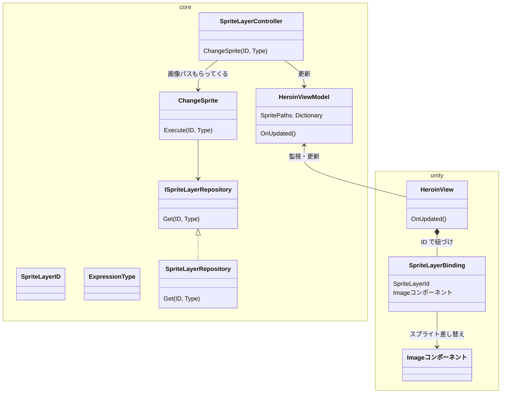
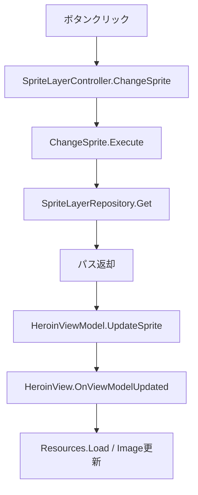

API 設計なんも考えてなかったー

```md
1. X1 にイラスト差し替え命令を送る
2. 差し替えるイラストパーツをリポジトリから引っ張ってくる
3. それを X2 に渡す
4. 渡すと X2 が見た目を更新する
```

「見た目」はビジネスロジックではなさそうだから、Presentation。core まで置くか？
「表情」ないし「感情」のパラメータと、表情パーツプリセットは必要(ex. スン、ムラムラ、ドキドキとか)
あと身体のパーツも動かすならプリセット化する必要あり？

プリセット化だいぶわからないから考えられない

ひとまず PoC/ChangeIllust での目標は

1. ボタンを押して表情を変えられる
2. ボタンを押して感情を変えられる
3. ボタンを押して動きを変えられる

を目指そう

## 入力からイラストパーツ取得の導線

決定事項:

- UseCase の引数は表情タイプのみ（UI 側はパーツ構造を知らない）
- スプライトレイヤーの識別子は `SpriteLayerId`（`PartID` とは別概念）
- `SpriteLayerId` は Application 層で宣言（Presentation・UseCase の両方が参照できる）
- VM は既存の `HeroinViewModel` に `Dictionary<SpriteLayerId, string>` を追加する

1. ボタンクリック
2. Controller → `ChangeSpriteLayerUseCase.Execute(expressionType)`
    - 戻り値: `Dictionary<SpriteLayerId, string>`（レイヤーごとのアセットパス）
    - 検索失敗は exception で OK
3. `SpriteLayerRepository.Find(expressionType)` → `Dictionary<SpriteLayerId, string>` を返す
    - アセット実体ではなくパスを返す
4. Controller が戻り値を `HeroinViewModel` に渡して更新
    - `HeroinViewModel.OnUpdated` 発火
    - `HeroinView` が購読してスプライトを差し替え

SpriteLayerRepository を実装する

- 特定位置に画像ディレクトリがある
- Get()したらディレクトリからファイル探してくる
- あったらパス返す



処理の流れ



## TODO

### シナリオから差し替えを呼び出す

- [ ] Yarn コマンドで `SpriteLayerController.ChangeSprite()` を呼べるようにする。

- `ScenarioCommandHandler` に `<<change_sprite layerID state>>` コマンドを追加
- `DialogueRunner.AddCommandHandler` でランタイム登録（`[YarnCommand]` はインスタンスメソッドに付けない）
- これによりシナリオの進行に合わせてヒロインの見た目を変えられる

### おさわりリアクションから差し替えを呼び出す

- [ ] おさわり時に表情が変わるようにする。

- Yarn シナリオ内の `<<change_sprite>>` コマンドとして記述するのが自然な流れ
- おさわり → イベント発火 → シナリオ再生 → `<<change_sprite>>` の順で動く

### アセット拡充

- [ ] 表情差分（eyes, mouth, eyebrow, cheek）を増やす
- [ ] 服の状態差分（hoodie, pants の段階）を増やす
- [ ] `Resources/Heroin/{layerID}/{state}.png` の命名規則に従う
