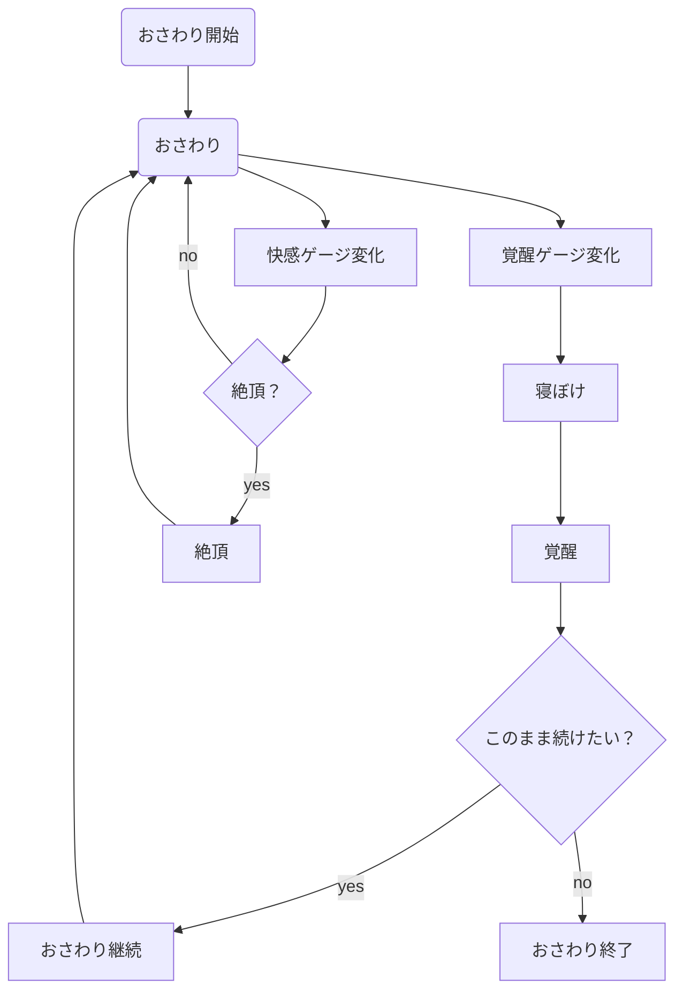

```mermaid
graph
	first(おさわり開始)-->touch(おさわり)
	
	touch-->覚醒ゲージ変化
	覚醒ゲージ変化-->寝ぼけ
	寝ぼけ-->覚醒
	覚醒-->check{このまま続けたい？}
	check-->|yes|おさわり継続
	check-->|no|おさわり終了
	おさわり継続-->touch
	
	touch-->快感ゲージ変化
	快感ゲージ変化-->climax_check{絶頂？}
	climax_check-->|yes|絶頂
	climax_check-->|no|touch
	絶頂-->touch
```
